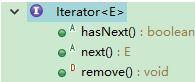
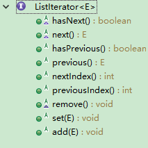

# Java 集合

## UML
**图片转载自[兰亭风雨](http://blog.csdn.net/ns_code/article/details/35564663)**

`Collection`：集合层次结构的根接口,主要的子接口是`List`、`Set`。

`List`：一个有序的 Collection（序列），**元素可重复**，常用的实现类是`ArrayList`、`LinkedList`。

`Set`：一个无序的 Collection（集合），**元素不可重复**,e1.equals(e2)=false，常用的实现类是`HashSet`、`EnumSet`。

`Map`：一个键值对的集合（Key - Value），映射的键不可以重复，且最多映射到一个值，常用的实现类是`HashMap`、`EnumMap`。

`Iterator`：遍历集合的迭代器，不可以遍历`Map`，`ListIterator`专门用于遍历`List`。

`Arrays`和`Collections`是操作数组、集合的工具类。

## 接口
### Collection

实现 Collection 的类必须实现两个构造方法
- 无参构造方法，创建一个空的 Collection
- 一个 Collection 参数的构造函数，用于克隆 Collection
|成员方法|作用|
|---|---|
|int size() |返回当前集合中元素的数量 |
|boolean isEmpty() |判断集合是否为空 |
|Iterator iterator() |返回一个迭代器 |
|**添加**| |
|boolean add(Object o) |添加对象到集合 |
|boolean addAll(Collection c) |将集合 C 中所有的元素添加给该集合 |
|**删除**| |
|void clear() |删除集合中所有元素 |
|boolean remove(Object o) |删除指定的对象 |
|void removeAll(Collection c) |从集合中删除 C 集合中的元素 |
|void retainAll(Collection c) |从集合中删除集合 C 中不包含的元素 |
|**查找**| |
|boolean contains(Object o) |查找集合中是否有指定的对象 |
|boolean containsAll(Collection c) |查找集合中是否有集合 C 中的元素 |
| Object[]	toArray() | 返回包含此 collection 中所有元素的数组|
|<T> T[]	toArray(T[] a)| 返回包含此 collection 中所有元素的数组，返回类型已确定|
### List
|成员方法|作用|
|---|---|
|E	get(int index) | 返回列表中指定位置的元素|
|E	set(int index, E element) |用指定元素替换列表中指定位置的元素|
|**添加**| |
|boolean add(E e) | 向列表的尾部添加指定的元素|
|void add(int index,Object element) |在指定位置上添加一个对象 |
|boolean addAll(int index,Collection c) |将集合 C 的元素添加到指定的位置 |
|**删除**| |
|Object removeint(int index)| 删除指定位置的元素 |
|**查找**| |
|int	indexOf(Object o) | 返回此列表中第一次出现的指定元素的索引；如果此列表不包含该元素，则返回 -1|
|int	lastIndexOf(Object o) |返回此列表中最后出现的指定元素的索引；如果列表不包含此元素，则返回 -1|
|**替换**| |
|Object set(int index,Object element) |用元素 element 取代位置 index 上的元素, 返回被取代的元素|

### Set
Set 没有定义新的方法

### Map
|成员方法|作用|
|---|---|
|int	size() |返回此映射中的键-值映射关系数|
|boolean	isEmpty() |如果此映射未包含键-值映射关系，则返回 true|
|**取值**||
|V	get(Object key) |返回指定键所映射的值；否则则返回 null|
|Set<K>	keySet() |返回此映射中包含的键的 Set 视图|
|Set<Map.Entry<K,V>>	entrySet() |返回此映射中包含的映射关系的 Set 视图|
|Collection<V>	values() |返回此映射中包含的值的 Collection 视图|
|**添加**| |
|V	put(K key, V value) |  将指定的值与此映射中的指定键关联|
|void	putAll(Map<? extends K,? extends V> m) |从指定映射中将所有映射关系复制到此映射中|
|**删除**| |
|V	remove(Object key) |如果存在一个键的映射关系，则将其从此映射中移除|
|void	clear() |从此映射中移除所有映射关系|
|**查找**| |
|boolean	containsKey(Object key) |如果此映射包含指定键的映射关系，则返回 true|
|boolean	containsValue(Object value) |如果此映射将一个或多个键映射到指定值，则返回 true|

## 实现类
### ArrayList
|构造方法|作用|
|---|---|
|ArrayList(int initialCapacity) | 构造一个具有指定初始容量的空列表|

|成员方法|作用|
|---|---|
|Object	clone() | 返回此 ArrayList 实例的浅表副本|
|void	ensureCapacity(int minCapacity) |  如有必要，增加此 ArrayList 实例的容量，以确保它至少能够容纳最小容量参数所指定的元素数|
|protected  void	removeRange(int fromIndex, int toIndex) | 移除列表中索引在 fromIndex（包括）和 toIndex（不包括）之间的所有元素|
|void	trimToSize() | 将此 ArrayList 实例的容量调整为列表的当前大小

### LinkedList
|成员方法|作用|
|---|---|
|Object	clone() | 返回此 LinkedList 的浅表副本。|
|**添加**| |
|void	addFirst(E e) | 将指定元素插入此列表的开头|
|void	addLast(E e) | 将指定元素添加到此列表的结尾|
|**删除**| |
|E	removeFirst() |  移除并返回此列表的第一个元素。|
|E	removeLast() | 移除并返回此列表的最后一个元素。|
|boolean	removeFirstOccurrence(Object o) | 从此列表中移除第一次出现的指定元素（从头部到尾部遍历列表时）。|
|boolean	removeLastOccurrence(Object o) |  从此列表中移除最后一次出现的指定元素（从头部到尾部遍历列表时）。|
|**取值**||
|E	element() |  获取但不移除此列表的头（第一个元素）。|
|E	getFirst() | 返回此列表的第一个元素。|
|E	getLast() | 返回此列表的最后一个元素。|
|**\***||
|E	pop() | 从此列表所表示的堆栈处弹出一个元素。|
|void	push(E e) | 将元素推入此列表所表示的堆栈。|
|**\***||
|E	peek() | 获取但不移除此列表的头（第一个元素）。|
|E	peekFirst() |  获取但不移除此列表的第一个元素；如果此列表为空，则返回 null。|
|E	peekLast() | 获取但不移除此列表的最后一个元素；如果此列表为空，则返回 null。|
|**\***||
|E	poll() | 获取并移除此列表的头（第一个元素）|
|E	pollFirst() | 获取并移除此列表的第一个元素；如果此列表为空，则返回 null。|
|E	pollLast() | 获取并移除此列表的最后一个元素；如果此列表为空，则返回 null。|
|**插入**||
|boolean	offer(E e) |  将指定元素添加到此列表的末尾（最后一个元素）。|
|boolean	offerFirst(E e) |  在此列表的开头插入指定的元素。|
|boolean	offerLast(E e) |  在此列表末尾插入指定的元素。|

### HashSet
没有定义新的方法
### HashMap
没有定义新的方法

存放一个映射时，先看 key 是否为空，然后求出 哈希码 确定在数组中的位置，遍历该位置的链表，如果有相同的key值，则覆盖 value，否则添加到链表上。

[HashMap的工作原理](http://www.importnew.com/7099.html)

Hashtable
- Hashtable是线程安全的
- 键和值不允许为null
- 不是快速失败

## 工具类
### Arrays
见数组一节。
### Collections
更多内容查看 [API](http://tool.oschina.net/uploads/apidocs/jdk-zh/java/util/Collections.html)

|成员方法|作用|
|---|---|
|static <T> void	copy(List<? super T> dest, List<? extends T> src) | 将所有元素从一个列表复制到另一个列表。|
|**添加**| |
|static <T> boolean	addAll(Collection<? super T> c, T... elements) | 将所有指定元素添加到指定 collection 中。|
|**查找**| |
|static int	indexOfSubList(List<?> source, List<?> target) | 返回指定源列表中第一次出现指定目标列表的起始位置；如果没有出现这样的列表，则返回 -1。|
|static int	lastIndexOfSubList(List<?> source, List<?> target) | 返回指定源列表中最后一次出现指定目标列表的起始位置；如果没有出现这样的列表，则返回 -1。|
|static boolean	disjoint(Collection<?> c1, Collection<?> c2) |  如果两个指定 collection 中没有相同的元素，则返回 true。|
|**替换**| |
|static <T> void	fill(List<? super T> list, T obj) | 使用指定元素替换指定列表中的所有元素。|
|static <T> boolean	replaceAll(List<T> list, T oldVal, T newVal) | 使用另一个值替换列表中出现的所有某一指定值。|
|**排序**| |
|static void	reverse(List<?> list) |  反转指定列表中元素的顺序。|
|static <T extends Comparable<? super T>>  void	sort(List<T> list)|  根据元素的自然顺序 对指定列表按升序进行排序。|
|static <T> void	sort(List<T> list, Comparator<? super T> c) | 根据指定比较器产生的顺序对指定列表进行排序。|
|static <T extends Object & Comparable<? super T>>  T	max(Collection<? extends T> coll) | 根据元素的自然顺序，返回给定 collection 的最大元素。|
|static <T> T	max(Collection<? extends T> coll, Comparator<? super T> comp) |  根据指定比较器产生的顺序，返回给定 collection 的最大元素。|
|static <T extends Object & Comparable<? super T>>  T	min(Collection<? extends T> coll) | 根据元素的自然顺序 返回给定 collection 的最小元素。|
|static <T> T	min(Collection<? extends T> coll, Comparator<? super T> comp) | 根据指定比较器产生的顺序，返回给定 collection 的最小元素。|

### Iterator 和 ListIteratocr
[https://docs.oracle.com/javase/8/docs/api/java/util/Iterator.html](https://docs.oracle.com/javase/8/docs/api/java/util/Iterator.html)

[https://docs.oracle.com/javase/8/docs/api/java/util/ListIterator.html](https://docs.oracle.com/javase/8/docs/api/java/util/ListIterator.html)

## 备注
关于对象的比较和排序，请看另一篇。
## 参考
- [容器和泛型 | BYSocket](http://www.bysocket.com/?cat=12)
- [【Java集合源码剖析】Java集合框架 | 兰亭风雨](http://blog.csdn.net/ns_code/article/details/35564663)
