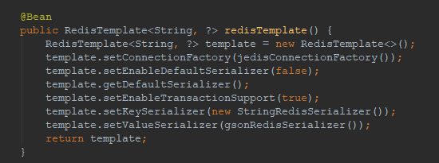
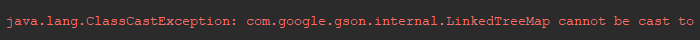

# Spring cache 中配置 redis 使用 gson 序列化值



需要编写一个 GsonRedisSerialzer 进行适配

这是 github 上的几个参考

- https://github.com/yefxyz/scorepio/blob/d6a5a33dffaa4e591a4cca5e16c255da90837abe/src/main/java/com/andre/core/repository/redis/GsonRedisSerializer.java
- https://github.com/pluone/redis-cache/blob/master/src/main/java/one/plu/rediscache/GsonRedisSerializer.java
- https://github.com/jeffzhao1985/spring-cloud-demo/blob/master/demo/provider-dict-mybatis-redis2/src/main/java/com/kkl/demo/config/GsonRedisSerializer.java

基本的就是简单实现继承RedisSerializer 接口的两个方法，直接使用 gson 的 toJson fromJson ，第二种是使用泛型，并且添加了成员变量来保存的类型，初始化的时候设置。

但是不管是哪两种，使用 gson.fromJson 的时候，可以从配置中看到，参数 type 都是 Object.class ,当遇到复杂类型的时候都会报类型转换异常,因为反序列化的时候找不到正确的类型。



考虑 **使用包装类保存类型**，将类型记录到 redis 的 json 中。

data 存放原本缓存的值的序列化，使用 type 记录类型。反序列化的时候，能明确的知道存储的缓存类型就是 RedisCacheModle ，所以能正确的反序列化，然后使用 Class.fromName 传入 type 获取到类型，就能正确的反序列化 data。

优点是包装类只存在于这个序列化的适配器中，不影响原本的代码。

缺点是序列化和反序列化都会通过两次，影响性能。

```java
@Data
public calss RedisCacheModle {
    String type;
    String data;
}
```

完整的 GsonRedisSerializer 如下

```java
import com.google.gson.Gson;
import org.springframework.data.redis.serializer.RedisSerializer;
import org.springframework.data.redis.serializer.SerializationException;

import java.lang.reflect.Type;

public class GsonRedisSerializer<T> implements RedisSerializer<T> {

    private Gson gson = new Gson();


    @Override
    public byte[] serialize(T o) throws SerializationException {
        RedisCacheModle modle = null;
        if (o != null) {
            modle = new RedisCacheModle(o.getClass().getName(), gson.toJson(o));
        }
        return gson.toJson(modle).getBytes();
    }

    @Override
    public T deserialize(byte[] bytes) throws SerializationException {
        RedisCacheModle modle = gson.fromJson(new String(bytes),RedisCacheModle.class);
        try {
            Class clazz = Class.forName(modle.getType());
            return gson.fromJson(modle.getData(), (Type) clazz);
        } catch (ClassNotFoundException e) {
            e.printStackTrace();
        }
        return null;
    }
}
```
